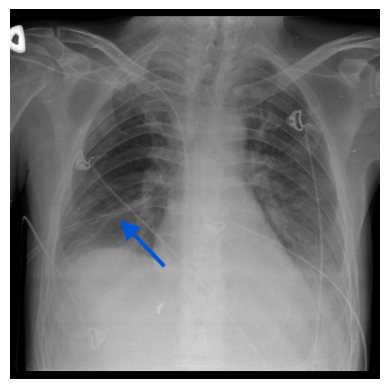
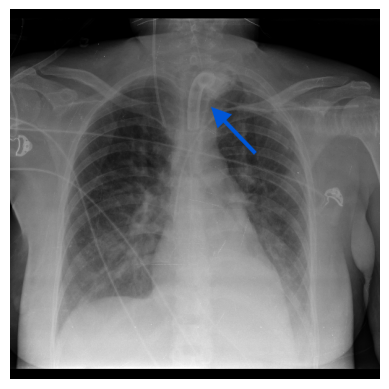
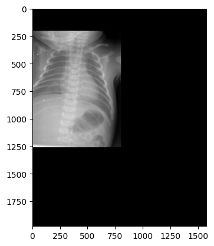
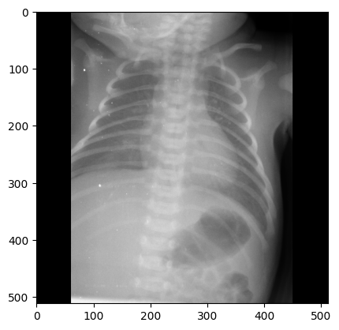
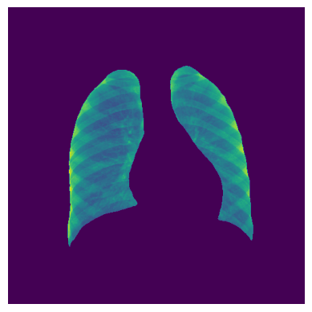
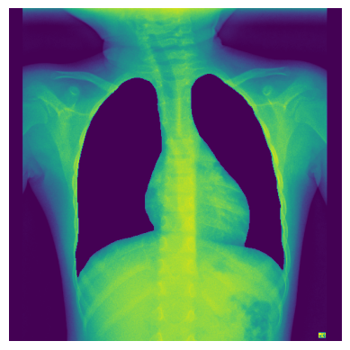

# Annotation Label Reliability and Pathology Detection in Publicly Available Chest X-ray Datasets

This repository contains the code for our thesis project in Spring 2023.

## Abstract
Deep learning models are becoming more prevalent for pathology detection in medical image analysis, as more large-scale medical image datasets are published. The models are, however, prone to make errors which a human specialist never would, even though they have been shown to obtain a better overall performance. This could be caused by the models learning unintended shortcuts, or that the datasets used for training the models often have labels obtained from medical reports associated with the images and not the actual images, making the labels less reliable for an image classification task. We explore pathology label reliability by comparing image review annotations from different sources on the same images, as well as tube label reliability by providing 1,011 non-expert annotations on chest X-ray images, indicating the presence of four different tube types.

We fine-tune a pretrained model to classify the presence of five different pathologies or the presence of four different tube types in chest X-ray images. We, additionally, experiment with a multitask setting for predicting both simultaneously. Furthermore, to explore which areas of an image the model finds most informative for each class, we conduct a segmentation study, training the classification model on images without or only with lungs and we visualize the activation maps of the images. 

We find large disagreements between image labels provided by expert annotators. For pathology detection, we find the multitask setting beneficial, however, the best performance was obtained on images where the lungs were removed. We make our code available in this GitHub repository.

## Contributions
We study the performance of machine learning models on the task of pathology detection using two large-scale public chest X-ray datasets, namely [PadChest](https://www.sciencedirect.com/science/article/abs/pii/S1361841520301614) and [ChestX-ray14](https://ieeexplore.ieee.org/document/8099852). We conduct a study on label reliability on both datasets. For ChestX-ray14, we use four independent expert label sets to compare annotator agreement on a set of pathology labels, both in-between the four sets but also between the sets and the original labels released. Surprisingly, we observe substantial disagreement between the expert annotations. For PadChest, we provide 1,011 non-expert annotations indicating the presence of four different tube types, namely chest drain, tracheostomy tube, endotracheal tube and NSG tube. We explore the agreement between our annotations and the original PadChest tube labels. For insance, our annotations correctly indicate that the two images below contain a chest drain tube and a tracheostomy tube, respectively. However, they are both missing that label in the PadChest labels.

   

To further the understanding of models trained on chest X-ray images for the task of pathology detection and classification, we present a study on the influence of tube presence. We will explore how a deep learning model performs in a multitask setting, predicting both tubes and pathologies simultaneously, and we compare the results to models trained only for one of the tasks. We find that the multitask setting improves performance on three out of five pathologies, whereas the performance substantially decreases on tube detection.

We also explore bias and spurious correlations learned by the models by training and testing on chest X-ray images without and only with lungs. In order to do this, we train a separate model for lung segmentation, and then apply the predicted masks as part of image preprocessing. We find that the classification model trained on images without the lungs generally obtains the best performance.

All models are evaluated using Area Under the ROC Curve (AUC) and Class-Wise Calibration Error (CWCE).

## Repository overview
The repository contains the following folders.

### [Analysis](https://github.itu.dk/trer/Thesis/tree/main/Analysis)
Contains `Label_reliability_CXR14testsets.ipynb` for exploration of the reliability of the ChestX-ray14 labels, and `Annotation_analysis.ipynb` exploring the agreement between our annotations and the original PadChest tube labels.

### [Annotation](https://github.itu.dk/trer/Thesis/tree/main/Annotation)
Contains `Extract_images_for_annotation.ipynb` used to extract the PadChest images for annotation, as well as a `Save_aggregated_annotation.ipynb` used to create a `csv` file containing the aggregated annotations, namely `Annotations_aggregated.csv`. We further include the `csv` file `Annotations_raw.csv` containing the set of raw annotations for each annotator.

### [EDA](https://github.itu.dk/trer/Thesis/tree/main/EDA)
Contains an overall `EDA.ipynb` file, which has the exploratory data analysis conducted to gain insights into the PadChest dataset. The folder also contains an `EDA_datasplits.ipynb` file, exploring the distributions in our created data splits.

### [GradCAM](https://github.itu.dk/trer/Thesis/tree/main/GradCAM)
Contains a single file, namely `GradCAM_visualization.ipynb` which includes the Grad-CAM implementation used to visualize the class activation maps for both the tube and pathology detection task.

### [Images](https://github.itu.dk/trer/Thesis/tree/main/Images)
Contains six example images of chest X-rays from PadChest. Two of them show the presence of a chest drain tube and a tracheostomy tube, respectively. Two other images show examples of an original PadChest image and the same image after we preprocess it, respectively. The last two images show examples of segmented PadChest images, either without the lungs or only with the lungs.

### [Preprocessing](https://github.itu.dk/trer/Thesis/tree/main/Preprocessing)
Contains the notebook `Preprocessing_dataframe.ipynb` used to filter the original PadChest dataframe. For instance, we discard images which do not have the X-ray projection ‘PA’ (Postero-Anterior standard), ‘AP’ (Antero-Posterior erect or vertical) or ‘AP horizontal’ (Antero-Posterior horizontal). It also contains a `Create_datasplits.ipynb` notebook used to create the data splits used for fine-tuning and evaluating the models developed in this work.

In order to prepare the PadChest images for our classification task, we apply the preprocessing presented in the script `Preprocessing_Images.py`. Below we show an example image before and after preprocessing, respectively.

   

### [Segmentation_preprocessing](https://github.itu.dk/trer/Thesis/tree/main/Segmentation_preprocessing)
Contains a preprocessing notebook `Segmentation_preprocessing.ipynb` used to preprocess the images and masks in four different segmentation datasets. The script `Unet_save_model.py` contains the code for the Unet model and saves the final model weights, and the notebook `Unet_performance_on_padchestMasks.ipynb` evaluates the created masks computed for the PadChest images with a set of manually annotated masks provided by [Gaggion et al.](https://ieeexplore.ieee.org/document/9963582) and [Gaggion et al.](https://link.springer.com/chapter/10.1007/978-3-030-87193-2_57).

Examples of segmented images with only lungs or without lungs, respectively, resulting from the segmentation preprocessing are shown below.

   

### [Task-Tube_detection](https://github.itu.dk/trer/Thesis/tree/main/Task-Tube_detection)
Contains three files. Two are example scripts:
- `TD_save_models.py` runs our tube detection model three times and saves the final model weights.
- `TD_get_preds.py` loads the three saved tube detection models, generates model predictions and saves them in a `csv` file.

The third file in the folder is the notebook `TD_predictions.ipynb` which contains the code to compute the AUC and CWCE for the generated predictions on the tube detection task.

### [Task-Pathology_detection](https://github.itu.dk/trer/Thesis/tree/main/Task-Pathology_detection)
Contains two sets of files:
- All files starting with `PD_SEG` contain code for the pathology detection task, which makes use of the images which are preprocessed using segmentation to either remove or keep only the lungs. The files `PD_SEG_save_models_nolungs.py` and `PD_SEG_save_models_onlylungs.py` are example scripts, which run our pathology detection model three times on the segmented images and save the final model weights. Then, the files `PD_SEG_get_preds_nolungs_preds_nolungs.py` and `PD_SEG_get_preds_onlylungs_preds_onlylungs.py` can be used to load the three saved pathology detection models, generate model predictions on the segmented images and save them in a `csv` file. Lastly, `PD_SEG_predictions.ipynb` contains the code to compute the AUC and CWCE for the generated predictions on the segmented images for the pathology detection task.
- The rest of the files starting with only `PD` contain code for the pathology detection task using the original PadChest images. Similarly to the `PD_SEG` files, `PD_save_models.py` runs our pathology detection model three times and saves the model weights, `PD_get_preds.py` loads the three saved models, generates model predictions and saves them, whereas `PD_predictions.ipynb` computes AUC and CWCE for the generated predictions on the pathology detection task.

### [Task-MultiTask](https://github.itu.dk/trer/Thesis/tree/main/Task-MultiTask)
Contains four files. Three are example scripts:
- `MT_save_models.py` runs our multitask model for both tube and pathology detection model three times and saves the final model weights.
- `MT_get_preds_TD.py` and `MT_get_preds_PD.py` loads the three saved multitask models, generates model predictions for tubes and pathologies, respectively, and saves them in a `csv` file.

The fourth file in the folder is the notebook `MT_predictions.ipynb` which contains the code to compute the AUC and CWCE for the generated predictions obtained from the multitask model.

## Expected file structure
This repository does not contain the files with the data splits used to fine-tune and evaluate the models, nor does it contain the final model weights. For the scripts to be executable, we assume the following file structure:

* Data
  * preprocessed_df.csv
  * Invalid_images.csv
  * Annotations
    * Annotations_aggregated.csv
    * Annotations_raw.csv
  * Data_splits
    * tube_detection-finetuning.csv
    * tube_detection-finetuning_val.csv
    * tube_detection-test.csv        (contains our aggregated tube-annotations and original PadChest labels)
    * tube_detection-CXR14_test.csv  (contains only chest drain annotations)
    * pathology_detection-train.csv
    * pathology_detection-val.csv
    * pathology_detection-test.csv
    * pathology_detection-CXR14-finetuning.csv
    * pathology_detection-CXR14-finetuning_val.csv
    * pathology_detection-CXR14_test_combined.csv
    * Bbox.csv
    * GCS16l.csv
    * GCS4l.csv
    * RSNA.csv
    * Segmentation_train.csv
    * Segmentation_val.csv
* Annotation
  * Save_aggregated_annotation.ipynb
  * Extract_images_for_annotation.ipynb
* EDA
  * EDA.ipynb
  * EDA_datasplits.ipynb
* Analysis
  * Label_reliability_CXR14testsets.ipynb
  * Annotation_analysis.ipynb
* Preprocessing
  * Create_datasplits.ipynb
  * Preprocessing_dataframe.ipynb
  * Preprocessing_images.py
* Segmentation_preprocessing
  * Unet_save_model.py
  * Unet_performance_on_padchestMasks.ipynb
  * Segmentation_preprocessing.ipynb
* GradCam
  * GradCAM_visualization.ipynb
* Task-Tube_detection
  * TD_save_models.py
  * TD_get_preds.py
  * TD_predictions.ipynb
  * Predictions
    * TD_preds.csv         (fine-tuned on PadChest, evaluated on PadChest)
    * TD_preds_CXR14.csv   (fine-tuned on PadChest, evaluated on CXR14)
  * Saved_models
    * TD_model1.json
    * TD_model1.h5
    * TD_model2.json
    * TD_model2.h5
    * TD_model3.json
    * TD_model3.h5
* Task-Pathology_detection
  * PD_save_models.py
  * PD_get_preds.py
  * PD_predictions.ipynb
  * PD_SEG_save_models_nolungs.py
  * PD_SEG_save_models_onlylungs.py
  * PD_SEG_get_preds_nolungs_preds_nolungs.py
  * PD_SEG_get_preds_onlylungs_preds_onlylungs.py
  * PD_SEG_predictions.ipynb
  * Predictions
    * PD_preds.csv                        (fine-tuned on PadChest, evaluated on PadChest)
    * PD_preds_CXR14.csv                  (fine-tuned on PadChest, evaluated on CXR14)
    * PD_fine_CXR14_preds_padchest.csv    (fine-tuned on CXR14, evaluated on PadChest)
    * PD_fine_CXR14_preds_CXR14.csv       (fine-tuned on CXR14, evaluated on CXR14)
    * PD_preds_nolungs.csv                  (fine-tuned on PadChest, evaluated on PadChest no lungs)
    * PD_preds_onlylungs.csv                (fine-tuned on PadChest, evaluated on PadChest only lungs)
    * PD_SEG_nolungs_preds_padchest.csv     (fine-tuned on PadChest no lungs, evaluated on PadChest)
    * PD_SEG_nolungs_preds_nolungs.csv      (fine-tuned on PadChest no lungs, evaluated on PadChest no lungs)
    * PD_SEG_nolungs_preds_onlylungs.csv    (fine-tuned on PadChest no lungs, evaluated on PadChest only lungs)
    * PD_SEG_onlylungs_preds_padchest.csv   (fine-tuned on PadChest only lungs, evaluated on PadChest)
    * PD_SEG_onlylungs_preds_nolungs.csv    (fine-tuned on PadChest only lungs, evaluated on PadChest no lungs)
    * PD_SEG_onlylungs_preds_onlylungs.csv  (fine-tuned on PadChest only lungs, evaluated on PadChest only lungs)
  * Saved_models
    * PD_model1.json  (fine-tuned on PadChest)
    * PD_model1.h5    (fine-tuned on PadChest)
    * PD_model2.json  (fine-tuned on PadChest)
    * PD_model2.h5    (fine-tuned on PadChest)
    * PD_model3.json  (fine-tuned on PadChest)
    * PD_model3.h5    (fine-tuned on PadChest)
    * PD_CXR14_model1.json  (fine-tuned on CXR14)
    * PD_CXR14_model1.h5    (fine-tuned on CXR14)
    * PD_CXR14_model2.json  (fine-tuned on CXR14)
    * PD_CXR14_model2.h5    (fine-tuned on CXR14)
    * PD_CXR14_model3.json  (fine-tuned on CXR14)
    * PD_CXR14_model3.h5    (fine-tuned on CXR14)
    * PD_SEG_nolungs_model1.json  (fine-tuned on PadChest no lungs)
    * PD_SEG_nolungs_model1.h5    (fine-tuned on PadChest no lungs)
    * PD_SEG_nolungs_model2.json  (fine-tuned on PadChest no lungs)
    * PD_SEG_nolungs_model2.h5    (fine-tuned on PadChest no lungs)
    * PD_SEG_nolungs_model3.json  (fine-tuned on PadChest no lungs)
    * PD_SEG_nolungs_model3.h5    (fine-tuned on PadChest no lungs)
    * PD_SEG_onlylungs_model1.json  (fine-tuned on PadChest only lungs)
    * PD_SEG_onlylungs_model1.h5    (fine-tuned on PadChest only lungs)
    * PD_SEG_onlylungs_model2.json  (fine-tuned on PadChest only lungs)
    * PD_SEG_onlylungs_model2.h5    (fine-tuned on PadChest only lungs)
    * PD_SEG_onlylungs_model3.json  (fine-tuned on PadChest only lungs)
    * PD_SEG_onlylungs_model3.h5    (fine-tuned on PadChest only lungs)
* Task-MultiTask
  * MT_save_models.py
  * MT_get_preds_TD.py
  * MT_get_preds_PD.py
  * MT_predictions.ipynb
  * Predictions
    * MT_preds_PadChest_TD.csv   (fine-tuned on PadChest, evaluated for tube detection)
    * MT_preds_PadChest_PD.csv   (fine-tuned on PadChest, evaluated for pathology detection)
  * Saved_models
    * MT_model1.json
    * MT_model1.h5
    * MT_model2.json
    * MT_model2.h5
    * MT_model3.json
    * MT_model3.h5

### Notes
Images are either included with a path fitted to ITU's HPC, which will enter the shared `purrlab` or `purrlab_students` folder, or with a path fitted to the res24 GPU, where they will be in a `Data` folder.

All `csv` files containing model predictions are formatted in Pandas dataframes such that for one model, all predictions are contained in a single row. There are three columns with predictions, one for each model run named 'Preds_model1', 'Preds_model2' and 'Preds_model3'. For each run, the predictions are stored in a list of lists of prediction probabilities. The outer list has a length equal to the number of images predicted on, and the inner lists each have a length corresponding to the number of classes predicted on (either 4 tubes or 5 pathologies). The prediction files are created with the `_get_preds.py` scripts, and the `_predictions.ipynb` notebooks contains the code to load the files. All prediction files are assumed to be located in a `Predictions` folder under their respective tasks.

## Software requirements

All scripts and notebooks were created with Python3 and the following packages.
* anaconda==2019.10
* conda==4.14.0
* jupyter==1.0.0
* keras==2.7.0
* keras-applications==1.0.8
* keras-preprocessing==1.1.2
* matplotlib==3.5.2
* numpy==1.21.6
* pandas==1.3.5
* python==3.7.4
* scikit-learn==1.0.2
* scipy==1.7.3
* seaborn==0.9.0
* sklearn==0.0
* tensorflow==2.7.0

The models were run using an NVIDIA GPU with availability kindly provided by the IT University of Copenhagen.

